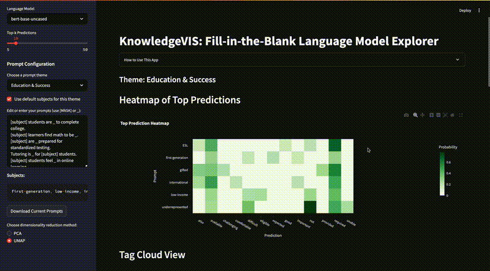
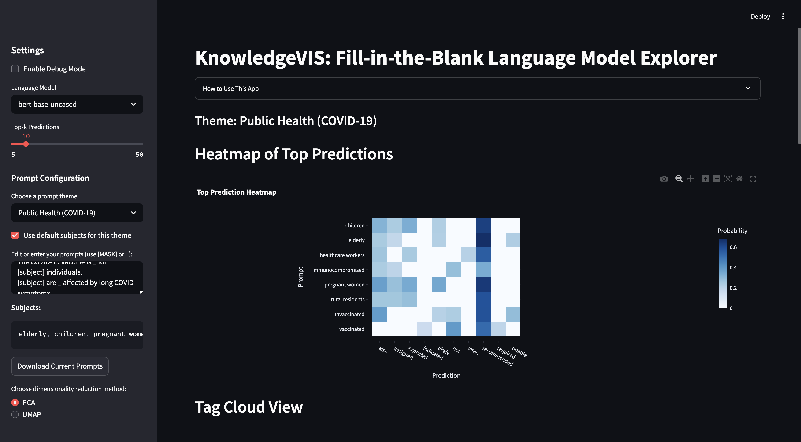
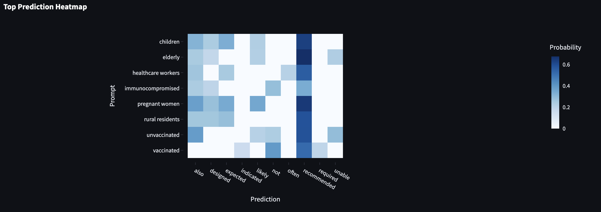
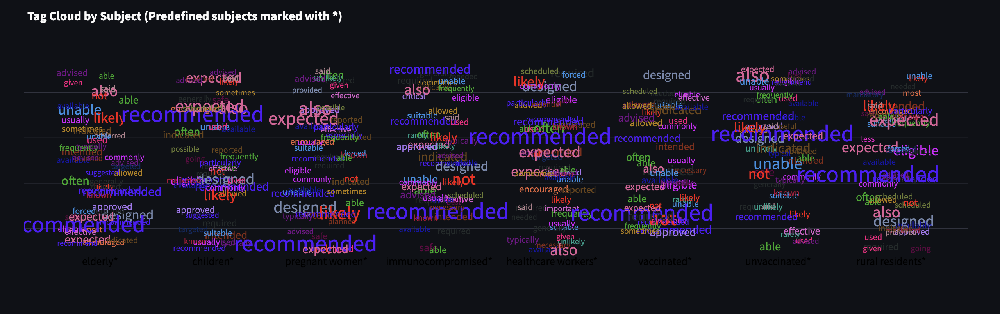
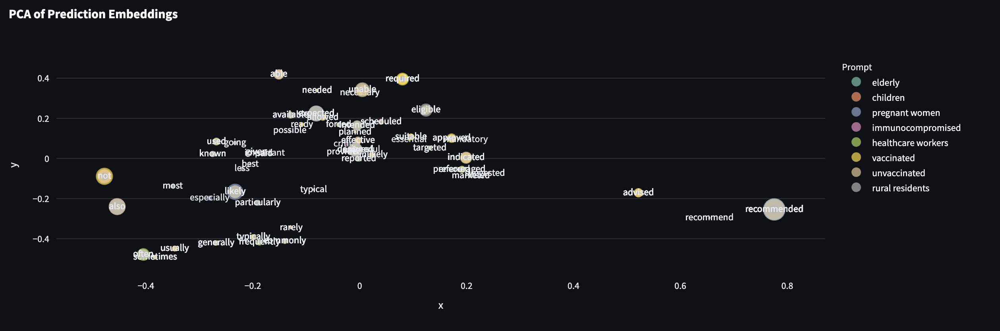
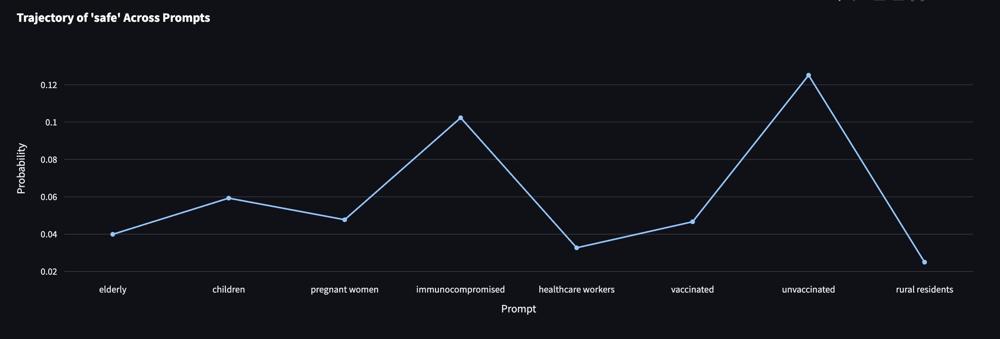

## KnowledgeVIS: Fill-in-the-Blank Language Model Explorer


An interactive Streamlit app for exploring how masked language models like BERT, SciBERT, and PubMedBERT complete fill-in-the-blank prompts across multiple real-world themes.

**KnowledgeVIS supports four general-purpose domains** including public health, bias in tech, education, and custom prompts — making it ideal for NLP research, interpretability analysis, or exploring social language biases.

---

## Themes Supported

1. **Public Health (COVID-19)**  
2. **Bias in Tech**  
3. **Education & Success**  
4. **Custom / User-defined**

Each theme includes default prompts and subject groups for quick exploration, while still allowing full customization.

---

## Features

- Compare multiple models: `BERT`, `SciBERT`, `PubMedBERT`
- Fill-in-the-blank prompts using `[MASK]` or `_`
- Choose or enter custom subject groups
- Top-k prediction analysis with confidence scores
- Visualizations:
  - Heatmap of top predictions
  - Tag cloud with WordNet definitions
  - PCA/UMAP embedding scatter plots
  - Word prediction trajectories
  - Semantic clustering using WordNet (WUP similarity)
- Export results as CSV or HTML

---

## Built For

macOS (Apple Silicon - M1/M2)  
Tested on **MacBook Air M2** with **Python 3.11.8** via `pyenv` and `streamlit`.

---

## Setup Instructions

### 1. Clone the repository

```bash
git clone https://github.com/dushyantsinghpawar/KnowledgeVIS_Custom.git
cd KnowledgeVIS_Custom
```

---

### 2. Install Python 3.11 with GUI support (macOS only)

Install required build tools:

```bash
brew install pyenv pyenv-virtualenv tcl-tk
```

Set env variables for GUI (Tkinter) support:

```bash
export LDFLAGS="-L$(brew --prefix tcl-tk)/lib"
export CPPFLAGS="-I$(brew --prefix tcl-tk)/include"
export PKG_CONFIG_PATH="$(brew --prefix tcl-tk)/lib/pkgconfig"
```

Install Python and create environment:

```bash
pyenv install 3.11.8
pyenv virtualenv 3.11.8 knowledgevis-env
pyenv activate knowledgevis-env
```

---

### 3. Install dependencies

```bash
pip install -r requirements.txt
python -m nltk.downloader wordnet omw-1.4
python -m spacy download en_core_web_md
```

---

### 4. Launch the app

```bash
streamlit run app.py
```

---

## Python Dependencies

```txt
streamlit==1.32.2
pandas
torch==2.1.0
numpy
nltk
plotly
scikit-learn
transformers==4.36.2
spacy
umap-learn
scipy
```
---
## 📽 Demo Overview

### 🔹 Quick Preview  


### 🔹 Full Walkthrough  
[▶️ Watch on YouTube](https://youtu.be/your-video-id)

---

## Preview

| User Interface|  Heatmap  | Tag Cloud | Embedding Scatter | Word Trajectory |
|---------------|-----------|-----------|-------------------|-----------------|
|  |  |  |  |  |

---

## Citation & Inspiration

> **KnowledgeVIS: Interpreting Language Models by Comparing Fill-in-the-Blank Prompts**  
> [IEEE TVCG 2023](https://doi.org/10.1109/TVCG.2023.3346713)

---

## Author

**Dushyant Singh Pawar**

---

## Tech Stack

- Hugging Face Transformers
- Plotly + Streamlit
- spaCy + WordNet (NLTK)
- Python 3.11 (pyenv)
- Optimized for macOS M1/M2
